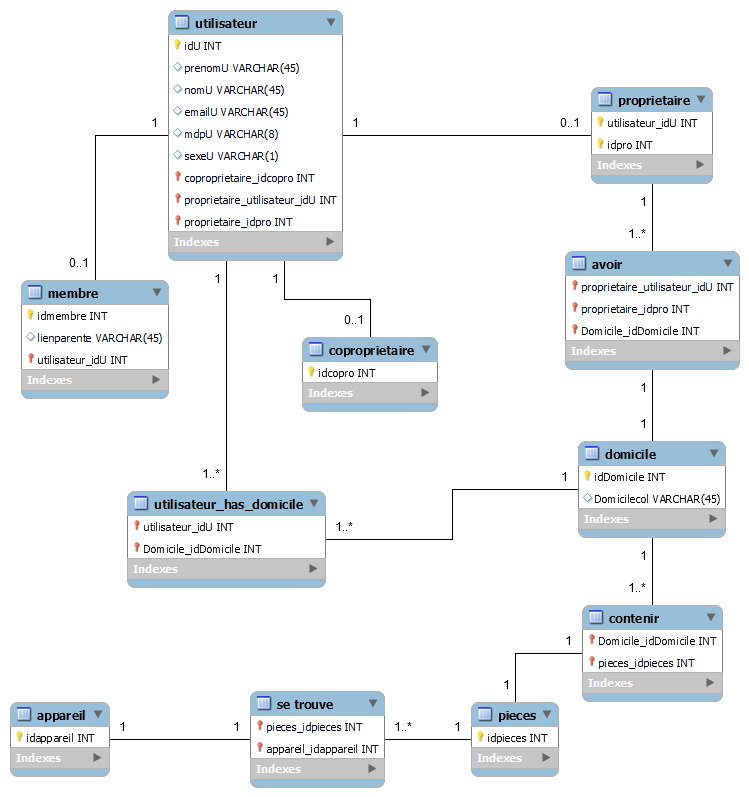
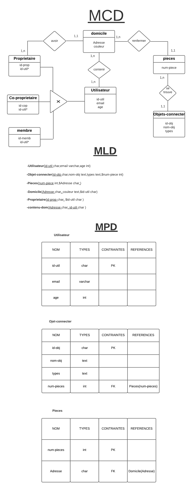

# SAYNA-UMLMERISE-JARVIS1-052022
<h2>Cas d'utilisation</h2>

<h3>Les différents acteurs dans le diagrammes sont :</h3>
-proprietaires 
-co-proprietaires 
-membres 
-visiteurs 
-Google API 
-Objet connecter 

<h2>Modèle conceptuel de données</h2>

